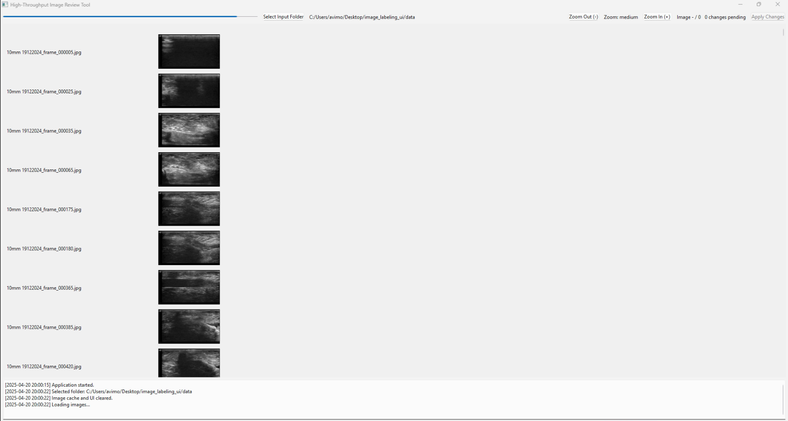

# High-Throughput Image Review Tool

A desktop application built with Python and PySide6 designed for researchers (or anyone) needing to quickly review and classify images into two categories ('center' and 'not_center'). It streamlines the labeling process by providing a thumbnail view, efficient keyboard shortcuts, and direct file management based on the assigned labels.



## Features

*   **Folder-Based Loading:** Loads images from specific `center` and `not_center` subdirectories within a chosen root folder.
*   **Thumbnail Preview:** Displays images as thumbnails in a vertically scrollable list for quick visual inspection.
*   **Adjustable Thumbnail Size:** Zoom in (+) and out (-) to change the size of thumbnails for better viewing.
*   **Efficient Labeling:**
    *   Use keyboard shortcuts (**A/Left** for 'not_center', **D/Right** for 'center', **Enter/Return** to toggle) for rapid classification.
    *   Click directly on an image thumbnail to toggle its label.
*   **Navigation:** Use **Up/Down Arrow keys** or the scroll wheel to navigate the image list.
*   **Pending Changes Tracking:** See how many images have been re-labeled and are pending changes.
*   **Apply Changes (File Moving):** Physically moves the image files between the `center` and `not_center` folders based on their final assigned labels when you click "Apply Changes" (or press **Ctrl+S**).
*   **Progress Indication:** A progress bar shows the current position within the image list.
*   **Logging:** Actions (loading, toggling, applying changes, errors) are logged to a console within the app and saved to an `image_review_log.json` file in the selected root folder.

## Requirements

*   **Python:** 3.8+ recommended
*   **PySide6:** (Install via `requirements.txt`)
*   **Operating System:** Tested on [Your OS, e.g., Windows 10/11, macOS Monterey+, Ubuntu 20.04+]. *Please update this with the OS you've tested on.*

## Installation

1.  **Clone the repository:**
    ```bash
    git clone https://github.com/[sagygabay]/[image-reviewer].git
    cd [your-repo-name]
    ```


2.  **Create and activate a virtual environment (recommended):**
    ```bash
    python -m venv venv
    # On Windows:
    .\venv\Scripts\activate
    # On macOS/Linux:
    source venv/bin/activate
    ```

3.  **Install dependencies:**
    ```bash
    pip install -r requirements.txt
    ```

## Usage

1.  **Prepare Your Image Folders:**
    *   Create a main input folder (e.g., `my_dataset`).
    *   Inside this folder, **you must create two subfolders:** `center` and `not_center`.
    *   Place the images you want to review into *either* the `center` or `not_center` folder based on their initial (or best guess) state. The tool requires these exact subfolder names to function correctly.
    *   Example structure:
        ```
        my_dataset/
        ├── center/
        │   ├── image1.jpg
        │   └── image3.png
        └── not_center/
            ├── image2.jpeg
            └── image4.tif
        ```

2.  **Run the application:**
    ```bash
    python image_reviewer.py 
    ```

3.  **Select Input Folder:** Click the "Select Input Folder" button and choose the main folder containing your `center` and `not_center` subdirectories (e.g., select `my_dataset` in the example above, **not** the `center` or `not_center` folders directly).

4.  **Review and Label:**
    *   Use the **Up/Down Arrow keys** or scroll wheel to navigate through images. The selected image row will be highlighted.
    *   Use **A** or the **Left Arrow** key to label the currently selected image as **'not_center'**.
    *   Use **D** or the **Right Arrow** key to label the currently selected image as **'center'**.
    *   Use **Enter/Return** or **click the thumbnail** of the selected image to toggle its current label (switch between 'center' and 'not_center').
    *   Use the **+/- keys** or the **Zoom buttons** to adjust thumbnail size.

5.  **Apply Changes:**
    *   When you are finished reviewing and labeling a batch of images, click the **"Apply Changes"** button or press **Ctrl+S**.
    *   This action will physically move the image files between the `center` and `not_center` folders on your disk according to the final labels you assigned in the tool.
    *   A log file (`image_review_log.json`) will be saved/updated in the root folder you selected.
    *   **Important:** Changes are only made permanent on your filesystem when you "Apply Changes". Closing the application without applying will discard any pending label changes.

6.  **Close** the application when done.


## Contributing

Contributions are welcome! Please feel free to submit a Pull Request or open an Issue for reporting bugs or suggesting features.

## Acknowledgements

This software was developed as part of my thesis work at [Sami-Shamoon college of Engineering (SCE),Isreal].
I extend my sincere thanks to my thesis supervisor, Chen Giladi, for their invaluable mentorship, feedback, and support.

## License

This project is licensed under the MIT License - see the [LICENSE](LICENSE) file for details.